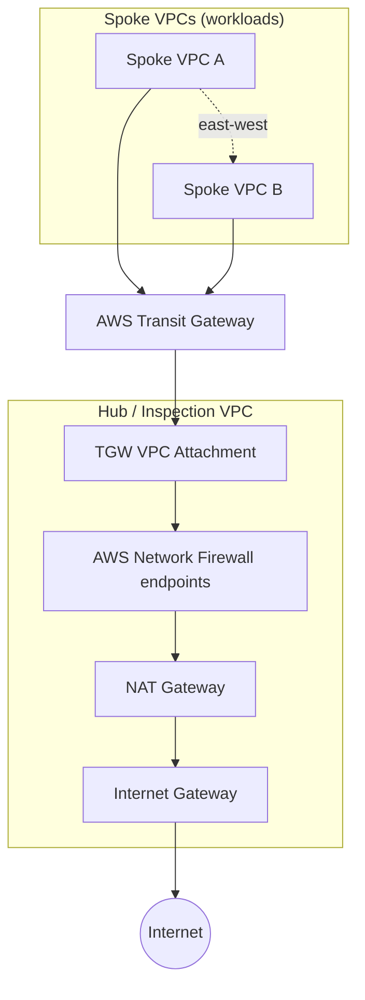

## Overview

Runbook for AWS Network Firewall designs, especially centralized inspection with Transit Gateway and VPC route tables. See also [VPC Lattice](#vpc-lattice) for service-to-service connectivity.

### Quick checklist

- Confirm firewall endpoints exist in every inspected AZ.
- Check route tables: traffic must route through the correct firewall endpoint or TGW attachment.
- Enable flow and alert logs before incident testing.
- Validate stateless default actions and stateful rule-group order.

### References

- [Network Firewall logs to CloudWatch](https://docs.aws.amazon.com/network-firewall/latest/developerguide/logging-cw-logs.html)
- [Network Firewall logs to S3](https://docs.aws.amazon.com/network-firewall/latest/developerguide/logging-s3.html)
- [Network Firewall CloudWatch metrics](https://docs.aws.amazon.com/network-firewall/latest/developerguide/monitoring-cloudwatch.html)

## Transit Gateway and Network Firewall


## **Original references (from Notion)**

> Original links preserved from your Notion page. **All diagrams below use public AWS-hosted URLs** (AWS blogs + AWS documentation) so they render without authentication.
> 

### **Centralized traffic filtering**

[**Deploy centralized traffic filtering using AWS Network Firewall | Amazon Web Services**](https://aws.amazon.com/blogs/networking-and-content-delivery/deploy-centralized-traffic-filtering-using-aws-network-firewall/)


---

### **Deployment models**

[**Deployment models for AWS Network Firewall | Amazon Web Services**](https://aws.amazon.com/blogs/networking-and-content-delivery/deployment-models-for-aws-network-firewall/)


---

### **Transit Gateway getting started**

[**Tutorials: Get started with AWS Transit Gateway - Amazon VPC**](https://docs.aws.amazon.com/vpc/latest/tgw/tgw-getting-started.html#step-test-tgw)


---

### **Egress VPC with TGW + CDK**

[**Building an egress VPC with AWS Transit Gateway and the AWS CDK | Amazon Web Services**](https://aws.amazon.com/blogs/networking-and-content-delivery/building-an-egress-vpc-with-aws-transit-gateway-and-the-aws-cdk/)


---

### **Outbound inspection (NAT + IGW)**

[**Outbound traffic inspection through a NAT gateway and internet gateway - AWS Prescriptive Guidance**](https://docs.aws.amazon.com/prescriptive-guidance/latest/inline-traffic-inspection-third-party-appliances/outbound-traffic-inspection-nat-gateway.html)


---

### **Additional diagrams**


---

### **Security groups**

[**Control traffic to your AWS resources using security groups - Amazon Virtual Private Cloud**](https://docs.aws.amazon.com/vpc/latest/userguide/vpc-security-groups.html#AddRemoveRules)


---

## **Transit Gateway routing (from Notion)**

[**How AWS Transit Gateway works - Amazon VPC**](https://docs.aws.amazon.com/vpc/latest/tgw/how-transit-gateways-work.html#tgw-routing-overview)

[**Transit gateway route tables in AWS Transit Gateway - Amazon VPC**](https://docs.aws.amazon.com/vpc/latest/tgw/tgw-route-tables.html#enable-tgw-route-propagation)

---

## **Operational checklist (from Network Firewall parent)**

From [Network Firewall](https://www.notion.so/357cd8b2d8788031bafed18fae78a192) parent page:

- [ ]  Verify route tables: subnet → TGW attachment routes
- [ ]  Verify Network Firewall endpoints are in the correct AZ/subnets
- [ ]  Verify security groups + NACLs for inspection subnets
- [ ]  Log destinations: CloudWatch Logs / S3 (enable before incidents)
- [ ]  Stateless vs stateful rule groups: order + default action
- [ ]  Test reachability with Reachability Analyzer when possible

---

## Architecture mental model



| Layer | Controls |
| --- | --- |
| **VPC route table** | Sends traffic *toward* TGW (spokes) or *toward* firewall subnets (hub) |
| **TGW route table** | Decides which attachment receives traffic (segmentation, egress steering) |
| **Network Firewall policy** | Allow/deny at L3–L7 (stateless + stateful rule groups) |
| **Security groups / NACLs** | Endpoint ENI reachability; stateless NACLs can break return traffic |

**Golden rules**

1. **Symmetric routing** — return path must mirror forward path (especially through firewall + NAT).
2. **One inspection path per flow** — avoid hairpinning or double-NAT unless designed.
3. **AZ affinity** — firewall endpoints and NAT in the same AZ as the traffic source when possible.
4. **TGW route table = segmentation** — separate RTs to block spoke-to-spoke while allowing shared egress.

---

## **Deployment patterns**

### **Pattern 1 — Centralized inspection VPC (hub)**

All internet-bound and (optionally) east-west traffic is steered to a dedicated **inspection VPC** with Network Firewall endpoints, then to NAT/IGW.

| Use when | Pros | Cons |
| --- | --- | --- |
| Multi-account / multi-VPC hub-and-spoke | Single policy enforcement point, easier auditing | Inspection VPC is a blast-radius / capacity choke point |
| Regulated egress | Consistent logging and filtering | Cross-AZ charges if not designed carefully |

**Reference:** [Deploy centralized traffic filtering using AWS Network Firewall](https://aws.amazon.com/blogs/networking-and-content-delivery/deploy-centralized-traffic-filtering-using-aws-network-firewall/)


---

### **Pattern 2 — Distributed (per-VPC) firewall**

Network Firewall deployed in each VPC; TGW used only for connectivity.

| Use when | Pros | Cons |
| --- | --- | --- |
| Strong isolation between tenants | No shared inspection choke point | Policy drift across VPCs |
| Lower cross-VPC traffic through hub | Simpler per-VPC routing | Higher operational overhead |

**Reference:** [Deployment models for AWS Network Firewall](https://aws.amazon.com/blogs/networking-and-content-delivery/deployment-models-for-aws-network-firewall/)

---

### **Pattern 3 — Egress VPC (TGW + NAT, firewall inline)**

Spokes send `0.0.0.0/0` (and RFC1918 if needed) to TGW → hub inspection VPC → NAT → IGW.

| Component | Role |
| --- | --- |
| Spoke RT | `0.0.0.0/0 → TGW` |
| TGW RT (spoke) | Default or hub CIDR → inspection VPC attachment |
| Inspection VPC RT | Firewall subnet → NAT → IGW |
| Hub TGW RT | Routes back to spoke CIDRs |

**Reference:** [Building an egress VPC with AWS Transit Gateway and the AWS CDK](https://aws.amazon.com/blogs/networking-and-content-delivery/building-an-egress-vpc-with-aws-transit-gateway-and-the-aws-cdk/)


---

### **Pattern 4 — East-west inspection between spokes**

Spoke A → TGW → inspection VPC (Network Firewall) → TGW → Spoke B.

Requires explicit TGW routes (no silent propagation) and SG rules allowing peer CIDRs **after** firewall policy permits.

---

## **TGW routing deep dive**

### **How TGW decides where to send packets**

1. Packet arrives at a **TGW attachment** (VPC, VPN, Direct Connect, peering).
2. TGW uses the **route table associated with that attachment** (association).
3. Longest-prefix match selects the target attachment.
4. Optional **route propagation** auto-adds routes (often disabled in production for control).

**Docs**

- [How Transit Gateway works](https://docs.aws.amazon.com/vpc/latest/tgw/how-transit-gateways-work.html#tgw-routing-overview)
- [Transit gateway route tables](https://docs.aws.amazon.com/vpc/latest/tgw/tgw-route-tables.html)
- [Enable/disable route propagation](https://docs.aws.amazon.com/vpc/latest/tgw/tgw-route-tables.html#enable-tgw-route-propagation)
- [Blackhole routes](https://docs.aws.amazon.com/vpc/latest/tgw/tgw-blackhole-route.html)


### **Segmentation example (spokes isolated, shared egress)**

| Route table | Associated with | Routes |
| --- | --- | --- |
| `tgw-rt-spoke-a` | Spoke A attachment | `10.0.0.0/16 → hub`, `0.0.0.0/0 → hub`, **no** route to Spoke B |
| `tgw-rt-spoke-b` | Spoke B attachment | `10.0.0.0/16 → hub`, `0.0.0.0/0 → hub`, **no** route to Spoke A |
| `tgw-rt-hub` | Hub / inspection attachment | `10.1.0.0/16 → A`, `10.2.0.0/16 → B` |

> **Mental model:** TGW route table = *who can talk to whom*; VPC route table = *how to reach TGW*.
> 

---

## **Network Firewall essentials**

### **Components**

| Component | Purpose |
| --- | --- |
| **Firewall policy** | Ordered rule groups + default actions |
| **Stateful rule group** | Connection-aware allow/deny (Suricata-compatible) |
| **Stateless rule group** | 5-tuple matching; runs first |
| **Firewall** | Binds policy to VPC |
| **Firewall endpoints** | AZ-local ENIs in dedicated subnets |

**Docs**

- [Network Firewall components](https://docs.aws.amazon.com/network-firewall/latest/developerguide/architecture-general.html)
- [Firewall policies](https://docs.aws.amazon.com/network-firewall/latest/developerguide/firewall-policies.html)
- [Stateful vs stateless rules](https://docs.aws.amazon.com/network-firewall/latest/developerguide/stateful-stateless-rulegroups.html)
- [Logging](https://docs.aws.amazon.com/network-firewall/latest/developerguide/logging.html)


### **Routing in the inspection VPC (typical)**

```
Spoke → TGW → Inspection VPC subnet
              → Route: 0.0.0.0/0 or peer CIDR → Firewall endpoint
              → Firewall endpoint subnet RT → NAT (egress) or back to TGW (east-west)
```

### **Rule evaluation order (simplified)**

1. **Stateless** rules (custom + AWS managed)
2. **Stateful** rules
3. **Default action** in policy (drop or forward)

> Enable **alert** and **flow** logs to S3 or CloudWatch **before** go-live.
> 

---

## **Hub-and-spoke egress (related concept)**

From your [Hub-and-spoke network](https://www.notion.so/344cd8b2d87880a8b9d4c756a073b946) notes — applies directly when adding a firewall:

### **Part 1 — All VPCs communicate; internet only via hub**

| Goal | Route pattern |
| --- | --- |
| Spoke ↔ Spoke | Spoke RT: peer CIDR → TGW; TGW RT: both spokes in same or hub RT |
| Spoke → Internet | Spoke RT: `0.0.0.0/0 → TGW`; Hub: NAT + IGW |
| Hub → Internet | Private RT: `0.0.0.0/0 → NAT`; Public RT: `0.0.0.0/0 → IGW` |

**With firewall:** insert Network Firewall **between** TGW attachment subnets and NAT for egress; update RTs so traffic hits firewall endpoints first.

### **Part 2 — Spokes isolated (no b ↔ c), shared egress**

- Separate TGW route tables per spoke (`tgw-rt-b`, `tgw-rt-c`)
- Hub RT has routes to both; spoke RTs have **no** cross-spoke routes
- Disable automatic propagation if it re-opens east-west paths

---

## **Troubleshooting playbook**

### **Symptom: No connectivity spoke → internet**

| # | Check |
| --- | --- |
| 1 | Spoke VPC RT: `0.0.0.0/0 → TGW` |
| 2 | TGW RT: route to inspection/hub attachment |
| 3 | Inspection VPC RT: traffic routed to **firewall endpoint** subnets |
| 4 | Firewall policy: default action not dropping unexpectedly |
| 5 | Post-firewall RT: `0.0.0.0/0 → NAT` |
| 6 | NAT in public subnet, EIP attached |
| 7 | Public RT: `0.0.0.0/0 → IGW` |
| 8 | SG on firewall endpoint ENIs: allow required ports |
| 9 | NACLs: not blocking ephemeral return ports |

### **Symptom: Spoke ↔ spoke works when it should not**

| # | Check |
| --- | --- |
| 1 | Separate TGW route tables — no route between spoke CIDRs |
| 2 | Route propagation disabled or scoped |
| 3 | Correct association: each attachment → intended RT only |

### **Symptom: Intermittent / one-AZ failures**

| # | Check |
| --- | --- |
| 1 | Firewall endpoint per AZ used by workloads |
| 2 | NAT Gateway AZ matches active traffic path |
| 3 | TGW attachment subnets span required AZs |

### **Tools**

- [VPC Reachability Analyzer](https://docs.aws.amazon.com/vpc/latest/reachability/what-is-reachability-analyzer.html)
- [VPC Flow Logs](https://docs.aws.amazon.com/vpc/latest/userguide/flow-logs.html)
- [Network Firewall logging](https://docs.aws.amazon.com/network-firewall/latest/developerguide/logging.html)
- TGW **Route analyzer** (console) for effective routes

---

## **Additional reference links**

### **AWS Transit Gateway**

| Topic | Link |
| --- | --- |
| What is a transit gateway? | [https://docs.aws.amazon.com/vpc/latest/tgw/what-is-transit-gateway.html](https://docs.aws.amazon.com/vpc/latest/tgw/what-is-transit-gateway.html) |
| TGW attachments | [https://docs.aws.amazon.com/vpc/latest/tgw/tgw-vpc-attachments.html](https://docs.aws.amazon.com/vpc/latest/tgw/tgw-vpc-attachments.html) |
| Appliance mode | [https://docs.aws.amazon.com/vpc/latest/tgw/transit-gateway-appliance-scenario.html](https://docs.aws.amazon.com/vpc/latest/tgw/transit-gateway-appliance-scenario.html) |
| Inter-Region peering | [https://docs.aws.amazon.com/vpc/latest/tgw/tgw-peering.html](https://docs.aws.amazon.com/vpc/latest/tgw/tgw-peering.html) |
| Quotas | [https://docs.aws.amazon.com/vpc/latest/tgw/transit-gateway-quotas.html](https://docs.aws.amazon.com/vpc/latest/tgw/transit-gateway-quotas.html) |

### **AWS Network Firewall**

| Topic | Link |
| --- | --- |
| Developer Guide | [https://docs.aws.amazon.com/network-firewall/latest/developerguide/what-is-aws-network-firewall.html](https://docs.aws.amazon.com/network-firewall/latest/developerguide/what-is-aws-network-firewall.html) |
| Creating a firewall | [https://docs.aws.amazon.com/network-firewall/latest/developerguide/firewall-creating.html](https://docs.aws.amazon.com/network-firewall/latest/developerguide/firewall-creating.html) |
| Suricata-compatible rules | [https://docs.aws.amazon.com/network-firewall/latest/developerguide/stateful-rule-groups-ips.html](https://docs.aws.amazon.com/network-firewall/latest/developerguide/stateful-rule-groups-ips.html) |
| AWS managed rule groups | [https://docs.aws.amazon.com/network-firewall/latest/developerguide/aws-managed-rule-groups.html](https://docs.aws.amazon.com/network-firewall/latest/developerguide/aws-managed-rule-groups.html) |
| Monitoring | [https://docs.aws.amazon.com/network-firewall/latest/developerguide/monitoring-cloudwatch.html](https://docs.aws.amazon.com/network-firewall/latest/developerguide/monitoring-cloudwatch.html) |

### **Prescriptive & architecture guidance**

| Topic | Link |
| --- | --- |
| Inline traffic inspection (third-party appliances) | [https://docs.aws.amazon.com/prescriptive-guidance/latest/inline-traffic-inspection-third-party-appliances/welcome.html](https://docs.aws.amazon.com/prescriptive-guidance/latest/inline-traffic-inspection-third-party-appliances/welcome.html) |
| Centralized egress with TGW | [https://docs.aws.amazon.com/whitepapers/latest/building-scalable-secure-multi-vpc-network-infrastructure/centralized-access-to-the-internet.html](https://docs.aws.amazon.com/whitepapers/latest/building-scalable-secure-multi-vpc-network-infrastructure/centralized-access-to-the-internet.html) |
| AWS Security Reference Architecture | [https://docs.aws.amazon.com/prescriptive-guidance/latest/security-reference-architecture/welcome.html](https://docs.aws.amazon.com/prescriptive-guidance/latest/security-reference-architecture/welcome.html) |
| Well-Architected — Security pillar | [https://docs.aws.amazon.com/wellarchitected/latest/security-pillar/welcome.html](https://docs.aws.amazon.com/wellarchitected/latest/security-pillar/welcome.html) |

### **Blogs (same series as Notion)**

| Title | Link |
| --- | --- |
| Centralized traffic filtering | [https://aws.amazon.com/blogs/networking-and-content-delivery/deploy-centralized-traffic-filtering-using-aws-network-firewall/](https://aws.amazon.com/blogs/networking-and-content-delivery/deploy-centralized-traffic-filtering-using-aws-network-firewall/) |
| Deployment models | [https://aws.amazon.com/blogs/networking-and-content-delivery/deployment-models-for-aws-network-firewall/](https://aws.amazon.com/blogs/networking-and-content-delivery/deployment-models-for-aws-network-firewall/) |
| Egress VPC with TGW + CDK | [https://aws.amazon.com/blogs/networking-and-content-delivery/building-an-egress-vpc-with-aws-transit-gateway-and-the-aws-cdk/](https://aws.amazon.com/blogs/networking-and-content-delivery/building-an-egress-vpc-with-aws-transit-gateway-and-the-aws-cdk/) |
| Automating Network Firewall with CDK | [https://aws.amazon.com/blogs/networking-and-content-delivery/automating-aws-network-firewall-deployments-with-aws-cdk/](https://aws.amazon.com/blogs/networking-and-content-delivery/automating-aws-network-firewall-deployments-with-aws-cdk/) |
| East-west inspection with TGW | [https://aws.amazon.com/blogs/networking-and-content-delivery/centralized-inspection-of-east-west-traffic-using-aws-transit-gateway/](https://aws.amazon.com/blogs/networking-and-content-delivery/centralized-inspection-of-east-west-traffic-using-aws-transit-gateway/) |

### **Public architecture diagrams (AWS blogs & documentation)**


### **Related (WAF — application layer, from parent page)**

[**AWS WAF for Application Load Balancers**](https://aws.amazon.com/blogs/aws/aws-web-application-firewall-waf-for-application-load-balancers/)

> **Note:** AWS WAF protects HTTP/S at ALB/API Gateway/CloudFront. **Network Firewall** operates at VPC perimeter (L3–L7). Use both in layered defense.
> 

---

## **Quick comparison: Network Firewall vs WAF vs SG**

| Control | Layer | Scope |
| --- | --- | --- |
| Security Group | Instance ENI | Allow/deny per ENI |
| Network ACL | Subnet | Stateless subnet boundary |
| **Network Firewall** | VPC / TGW hub | Centralized IDS/IPS-style filtering |
| **AWS WAF** | ALB / CloudFront / API GW | HTTP/S application attacks |

---

## VPC Lattice

Notes for Amazon VPC Lattice service-to-service connectivity, authorization, and observability across VPCs and accounts.

### Key concepts

- A **service network** is the logical boundary for services and resource configurations.
- Clients reach the network through VPC association or a service-network VPC endpoint.
- Use auth policies and observability deliberately; connectivity is not authorization.

### When to consider

- Microservices that span VPCs/accounts and need simpler application networking.
- Modernization paths where service discovery, connectivity, and monitoring should be centralized.

### References

- [VPC Lattice service networks](https://docs.aws.amazon.com/vpc-lattice/latest/ug/service-networks.html)
- [VPC Lattice reference architecture (PDF)](https://docs.aws.amazon.com/pdfs/architecture-diagrams/latest/amazon-vpc-lattice-use-cases/amazon-vpc-lattice-use-cases.pdf)

**See also:** [ShopSphere walkthrough]() · [CLI snippets — VPC Flow Logs]()
