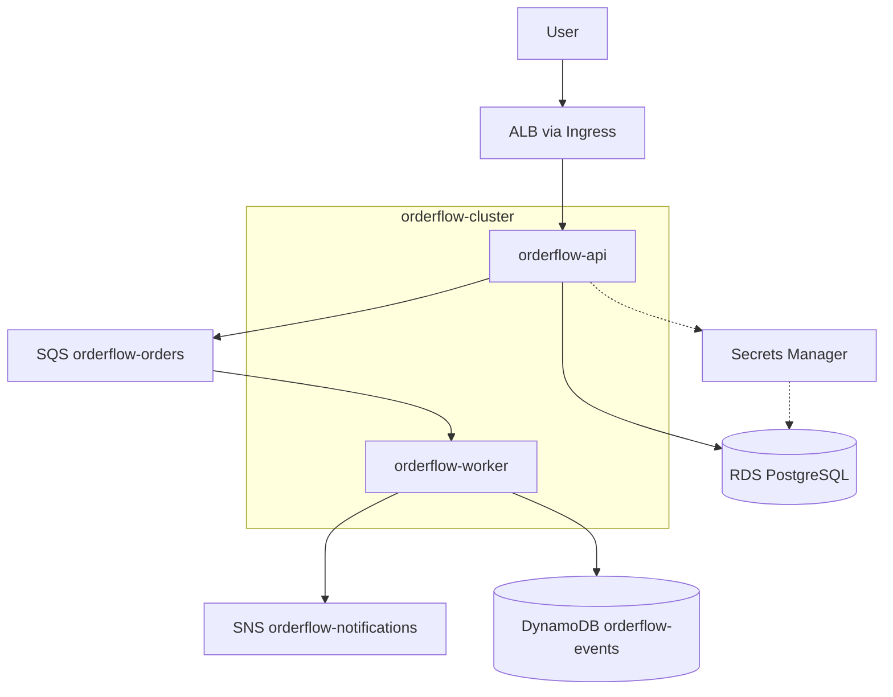

> Migrate ShopSphere from in-cluster PostgreSQL to managed RDS, Secrets Manager, and an event-driven pipeline with SQS, SNS, and DynamoDB on EKS.

**Prerequisite:** Complete [ShopSphere on Amazon EKS]() first — OrderFlow reuses EKS networking, ingress, and deployment patterns.

**Snippets:** [OrderFlow CLI and config]() · [IAM policies]()

## Migration at a glance

| ShopSphere (K8s-native) | OrderFlow (AWS-managed) |
|---------------------------|-------------------------|
| PostgreSQL StatefulSet + EBS | RDS PostgreSQL (`orderflow-db`) |
| Kubernetes Secrets in Git | Secrets Manager + IRSA |
| Synchronous API only | API → RDS + SQS → worker → SNS/DynamoDB |

## Final architecture

## Phases

| Phase | Topic |
|-------|-------|
| 01 | [Infrastructure Setup]() — VPC, subnets, NAT, routing |
| 02 | [EKS Cluster]() — control plane, node group, OIDC |
| 03 | [EBS CSI and Storage]() — add-on and gp3 StorageClass |
| 04 | [ECR Repositories]() — API, frontend, worker images |
| 05 | [AWS Load Balancer Controller]() — IRSA and Helm install |
| 06 | [API Deployment]() — namespace, Deployment, Service |
| 07 | [Ingress Configuration]() — ALB and path routing |
| 08 | [RDS PostgreSQL]() — private database and security groups |
| 09 | [Secrets Manager and IRSA]() — API credentials without K8s secrets |
| 10 | [API and Database Integration]() — schema, endpoints, health checks |
| 11 | [SQS Queue Integration]() — async order enqueue from API |
| 12 | [SNS and DynamoDB]() — notifications and event store |
| 13 | [Worker Deployment]() — queue consumer and IAM |
| 14 | [CloudWatch Observability]() — logs and Container Insights |
| 15 | [Roadmap]() — CloudFront, WAF, CI/CD, EventBridge |

**See also:** [Kubernetes on AWS]() · [Lambda event pipeline]()
