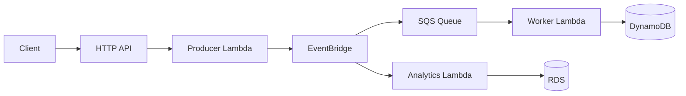

> Build and operate an event-driven serverless order pipeline with AWS SAM — Lambda, HTTP API, EventBridge, SQS, DynamoDB, and safe deployments.

**Code samples:** [Lambda event pipeline]() · [Serverless snippets]() · [IAM policies]()

## What you build

A minimal **order events** system:

1. **Producer API** accepts orders and publishes `OrderCreated` to EventBridge
2. **SQS + worker Lambda** processes messages and writes to DynamoDB
3. **Analytics Lambda** (optional) persists events to RDS for reporting
4. **SAM** packages and deploys everything; **CodeDeploy** canaries production releases

## Architecture

## Phases

| Phase | Topic |
|-------|-------|
| 01 | [SAM Project Setup]() — init, structure, globals |
| 02 | [Lambda Functions]() — handlers, roles, env vars |
| 03 | [HTTP API Gateway]() — routes, CORS, auth |
| 04 | [EventBridge]() — rules, targets, event schema |
| 05 | [SQS and Lambda Triggers]() — queues, DLQ, batching |
| 06 | [DynamoDB]() — table design, IAM, access patterns |
| 07 | [SAM Build and Deploy]() — build, local test, guided deploy |
| 08 | [Versions and Concurrency]() — aliases, reserved concurrency |
| 09 | [Application Auto Scaling]() — ECS, DynamoDB, custom metrics |
| 10 | [CI/CD with CodeDeploy]() — pipeline, canary, rollback |
| 11 | [Observability and Operations]() — logs, alarms, runbook |

**See also:** [OrderFlow on AWS]() (EKS variant of the same event pattern) · [Lambda CI/CD post]()
