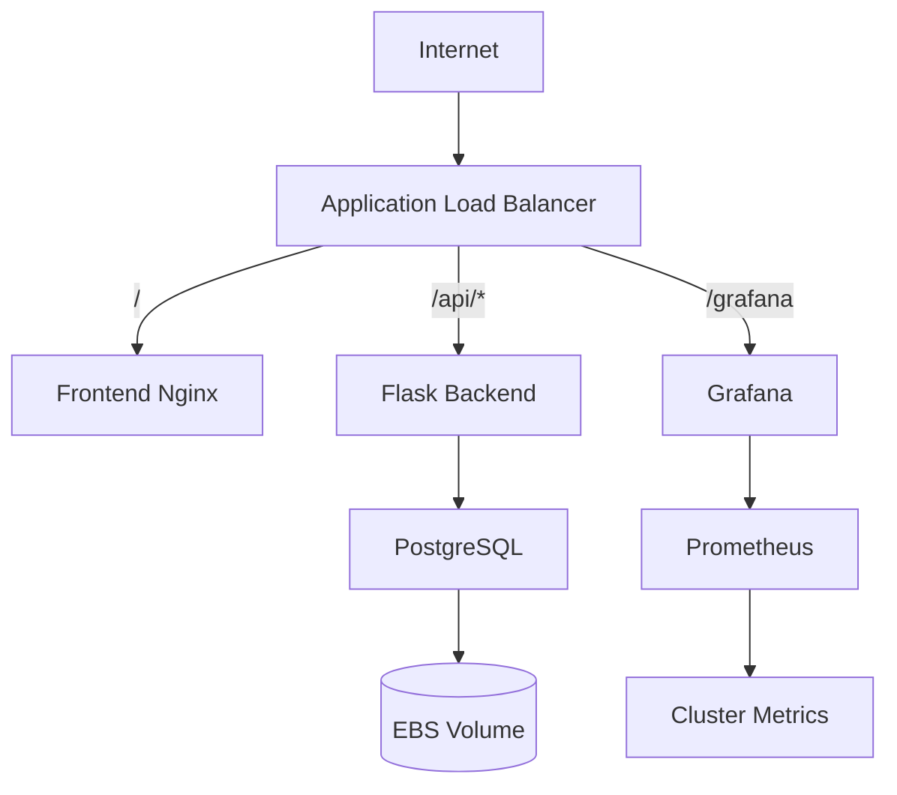

> Build and operate a production-style microservices application on Amazon EKS — VPC, persistence, ingress, autoscaling, observability, GitOps, and secrets.

## Final architecture

## Phases

| Phase | Topic |
|-------|-------|
| 01 | [Infrastructure Setup]() — VPC, subnets, NAT |
| 02 | [EKS Cluster Creation]() — control plane and node group |
| 03 | [EBS CSI Driver]() — persistent volume support |
| 04 | [PostgreSQL Persistence]() — StatefulSet and storage |
| 05 | [Application Deployment]() — backend and frontend images |
| 06 | [ConfigMaps and Secrets]() — configuration management |
| 07 | [Backend Database Integration]() — Flask API and PostgreSQL |
| 08 | [AWS Load Balancer Controller]() — ALB ingress controller |
| 09 | [Ingress Configuration]() — path-based routing |
| 10 | [Frontend Application]() — Nginx UI |
| 11 | [Metrics Server]() — resource metrics |
| 12 | [Horizontal Pod Autoscaler]() — pod autoscaling |
| 13 | [Prometheus and Grafana]() — monitoring stack |
| 14 | [Grafana Access and Dashboards]() — dashboards and access |
| 15 | [Application Metrics]() — custom app metrics |
| 16 | [Advanced Autoscaling with Karpenter]() — node provisioning |
| 17 | [GitOps Deployment with ArgoCD]() — declarative deploys |
| 18 | [DNS and TLS Automation]() — Route 53 and ACM |
| 19 | [Security and Secrets]() — Secrets Manager integration |

**See also:** [Kubernetes on AWS]() · [CLI snippets]() · [Backend app example]()
